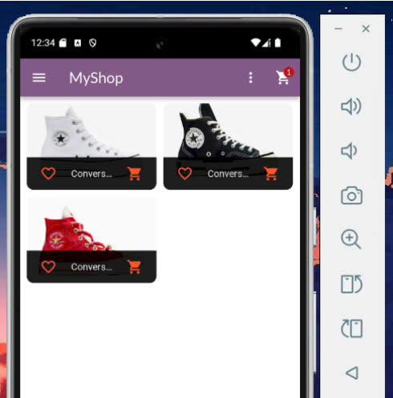
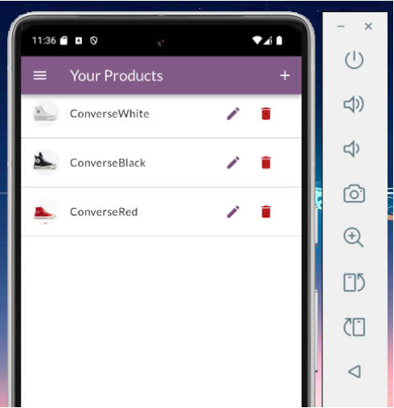
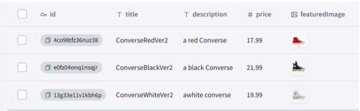
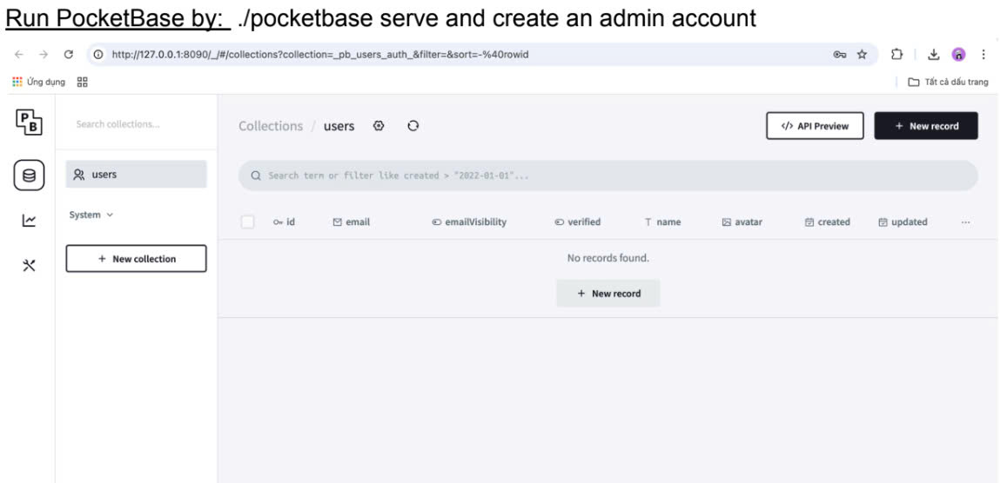
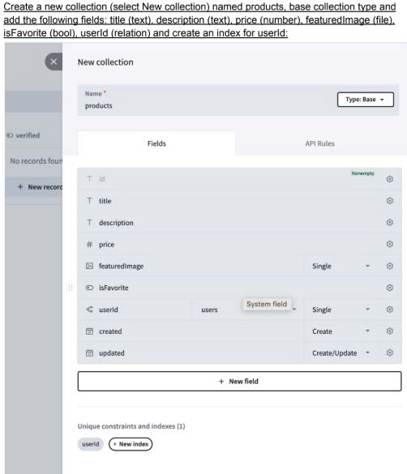
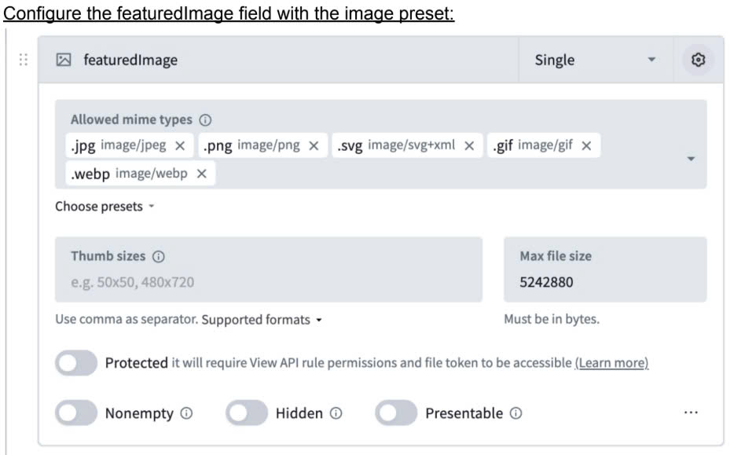
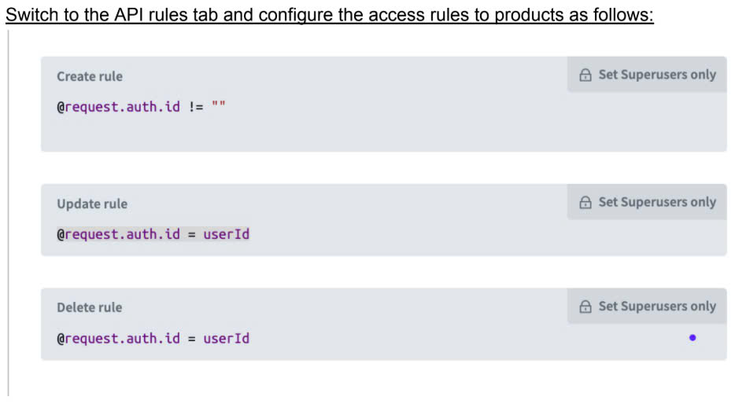
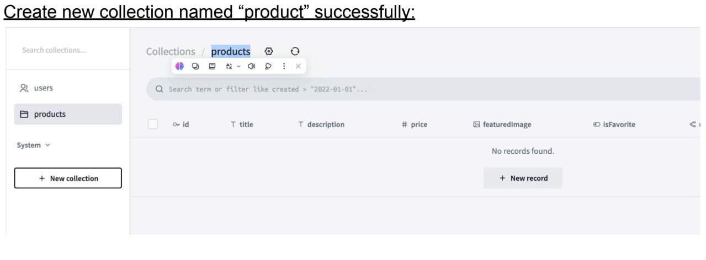

<!-- 
# myshop

Course: CT312H-Mobile Programming.

Semester 2, Academic year: 2024-2025.

**Student ID**: B2110011

**Student Name**: Nguyen Nhat Hao

**Class Number**: M0M1 
-->
# E-Commerce App

## Overview
The E-Commerce-App is a cross-platform Flutter mobile app for Android and iOS, designed for e-commerce. It features login/logout, product browsing, a favorites filter, cart management, and product detail pages with size selection and quantity adjustments. The app uses PocketBase for backend data storage and includes a user products page for managing items

## Features
- Product listing with favorites filter.
- Product details with size and quantity selection.
- Cart management and user product management.
- Backend powered by PocketBase.

## Interface illustration

  
  
   
  

## Setup
- Clone the repo
  
- Run `flutter pub get`
  
- Configure PocketBase
  

         
         
         
         
         
  

  
- Launch with `flutter run`.
